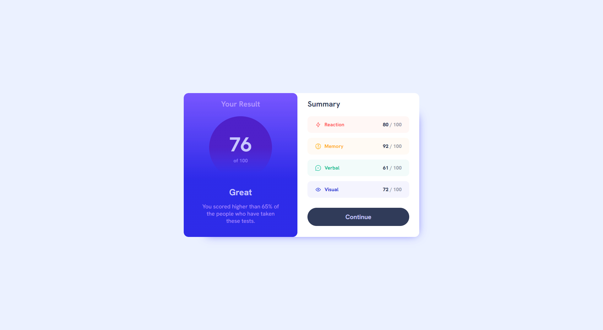
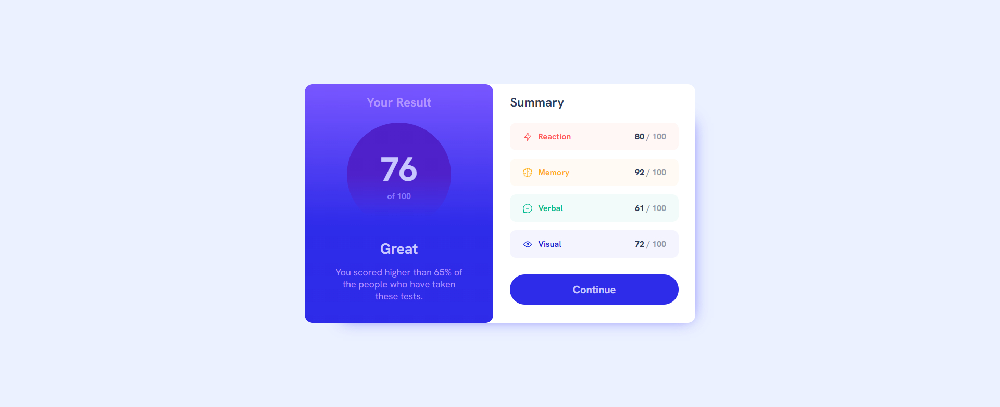
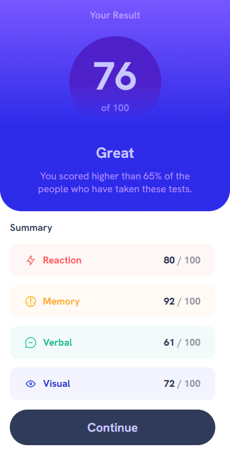

# Frontend Mentor - Results summary component solution

This is a solution to the [Results summary component challenge on Frontend Mentor](https://www.frontendmentor.io/challenges/results-summary-component-CE_K6s0maV). Frontend Mentor challenges help you improve your coding skills by building realistic projects.

## Table of contents

- [Frontend Mentor - Results summary component solution](#frontend-mentor---results-summary-component-solution)
  - [Table of contents](#table-of-contents)
  - [Overview](#overview)
    - [Screenshot](#screenshot)
    - [Links](#links)
  - [My process](#my-process)
    - [Built with](#built-with)
    - [What I learned](#what-i-learned)
    - [Continued development](#continued-development)
    - [Useful resources](#useful-resources)
  - [Author](#author)

## Overview

### Screenshot





### Links

- Solution URL: [GitHub](https://github.com/maciej-szeremeta/Results-summary-component-solution)
- Live Site URL: [GitHub Page](https://maciej-szeremeta.github.io/Results-summary-component-solution)

## My process

### Built with

- HTML
- CSS variables
- SCSS
- BEM
- Flexbox

### What I learned

In the current projection, I have attempted to apply the SCSS.

```html
<li class="summary__item summary__item--memory">
  <div class="logo-item">
    
    <span class="logo-item__text logo-item__text--memory">Memory</span>
  </div>
  <div class="summary-score">
    92 <span class="summary-score__number"> / 100</span>
  </div>
</li>
```

```scss
.summary {
  flex: 1;
  padding: 1.2rem 2rem;

  &__title {
    font-size: 1.5rem;
    color: var(--darkGrayBlueColor);
    margin-bottom: 1.5rem;
  }
  &__item {
    display: flex;
    justify-content: space-between;
    align-items: center;
    margin-bottom: 1rem;
    padding: 1rem 24px;
    border-radius: 12px;
    &--memory {
      background-color: hsla(39, 100%, 56%, 0.05);
    }
  }
```

### Continued development

In the next task I will explore the secrets of the preprocessor.

### Useful resources

- [SCSS](https://sass-lang.com/) - This page helped me understand how SCSS works.

## Author

- Frontend Mentor - [@maciej-szeremeta](https://www.frontendmentor.io/profile/maciej-szeremeta)
